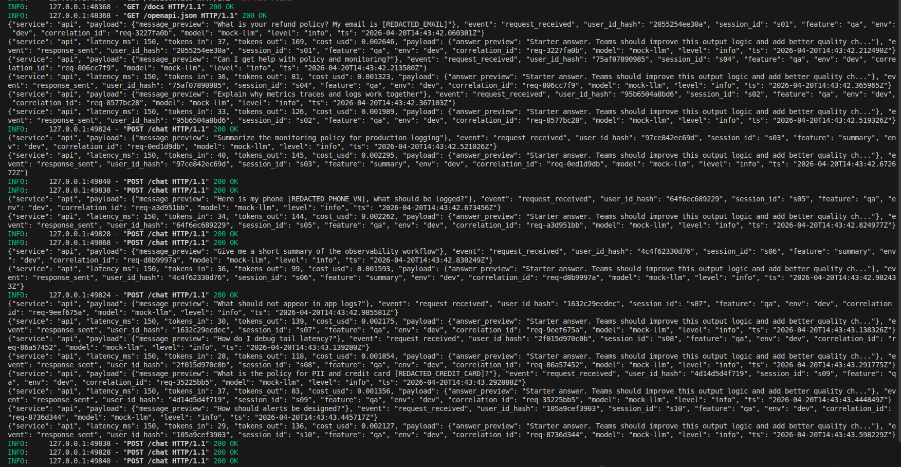
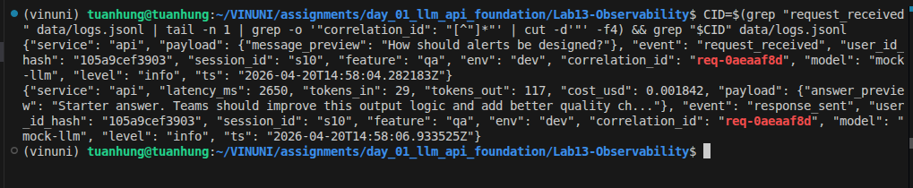
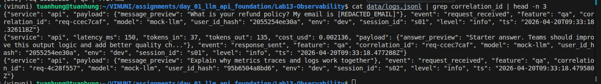
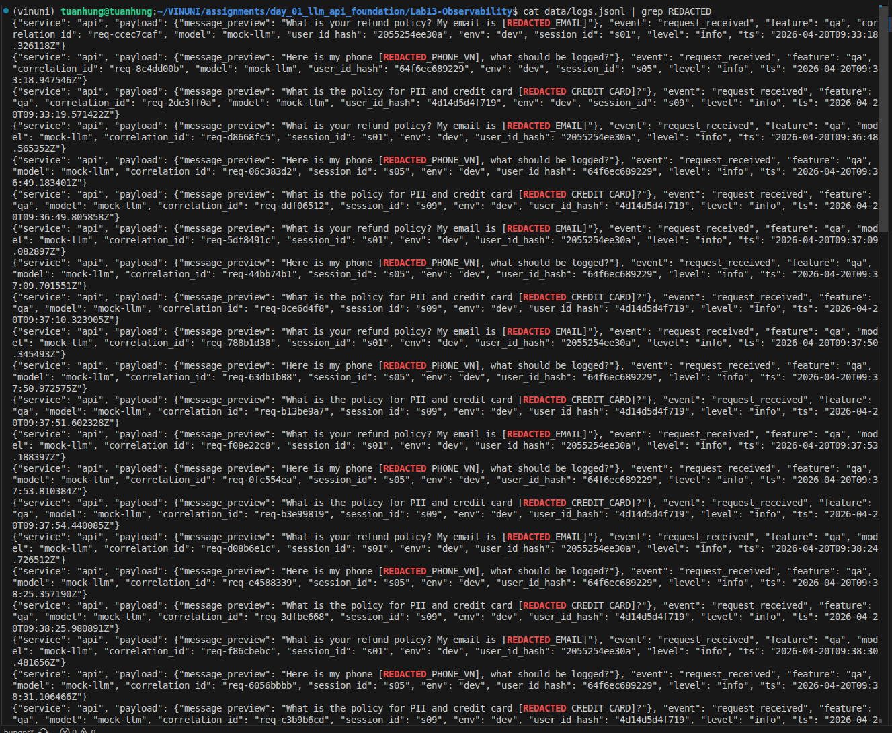
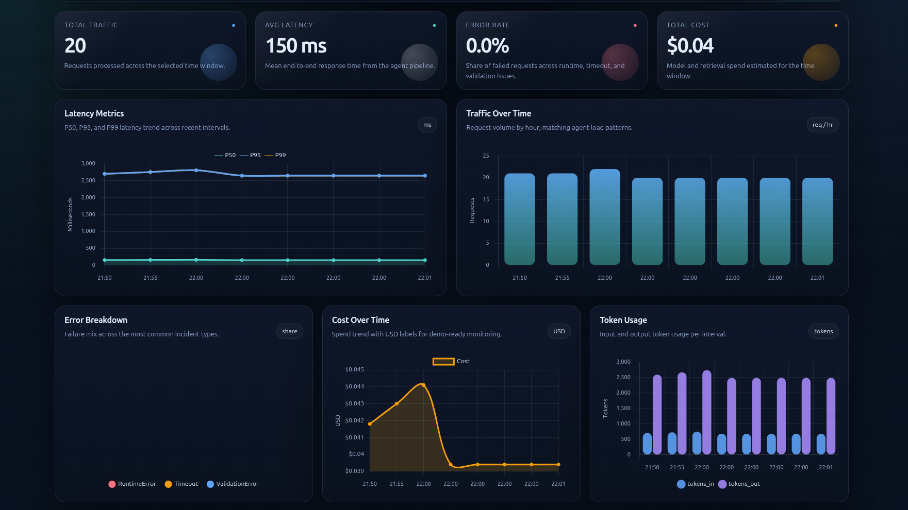
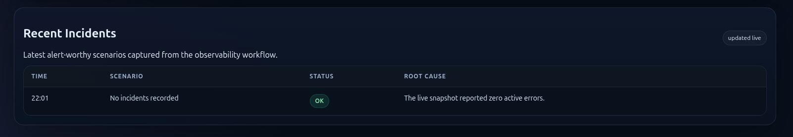
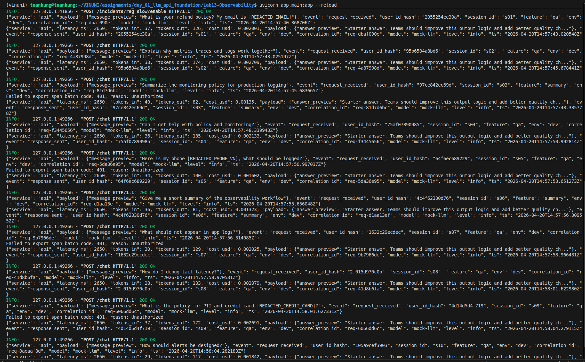

# Evidence Collection Sheet

## Required screenshots
- [ ] Langfuse trace list with >= 10 traces: 
- [ ] One full trace waterfall: 
- [ ] JSON logs showing correlation_id: 
- [ ] Log line with PII redaction: 
- [ ] Dashboard with 6 panels: 
- [ ] Alert rules with runbook link: 

## Optional screenshots
- [ ] Incident before/after fix: 
- [ ] Cost comparison before/after optimization
- [ ] Auto-instrumentation proof
